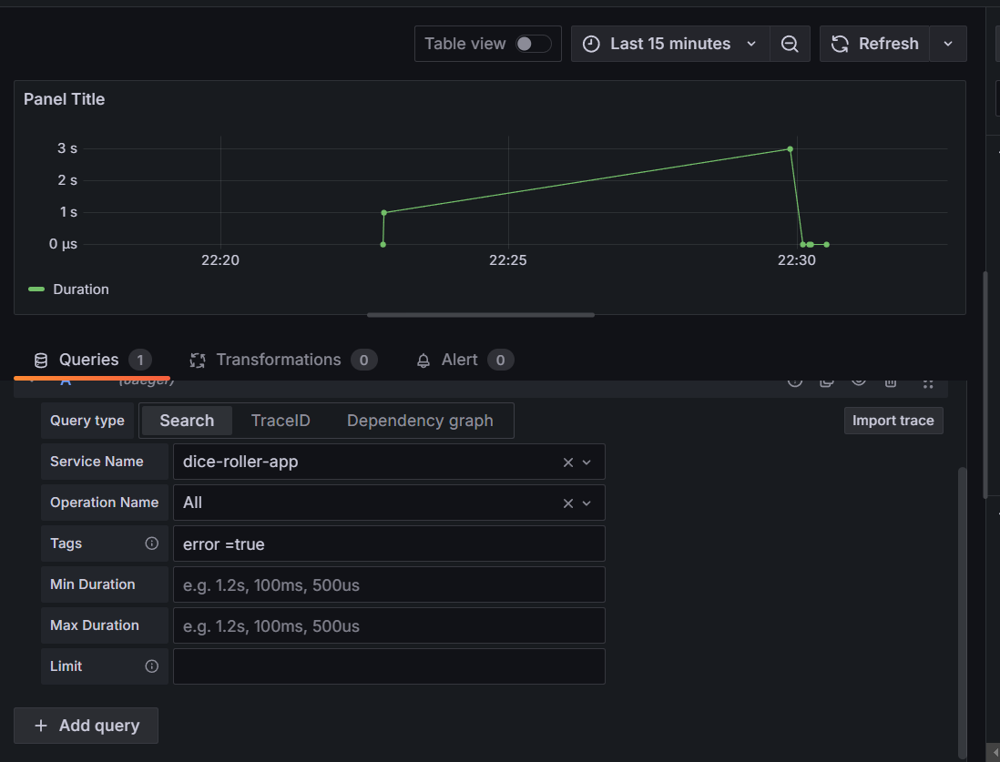
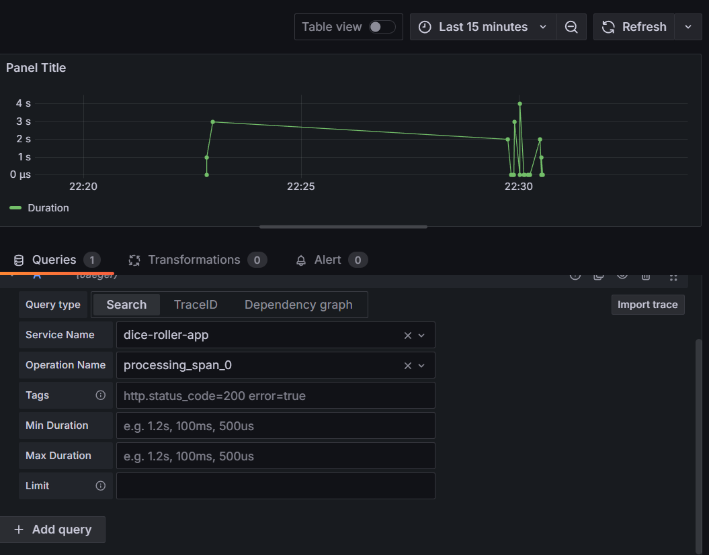
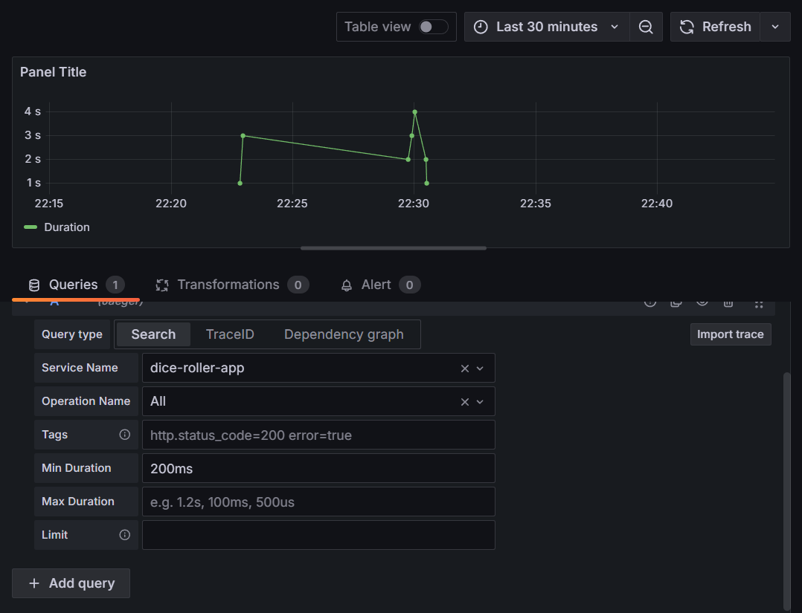

# DiceRollerTracesApp

Это приложение с интеграцией распределённой трассировки и использованием
OpenTelemetry симулирует подбрасывание кубика.

---

## Инструкция по запуску

**1.** Установите зависимостей:

```
pip install -r requirements.txt
```

**2.** Запустите приложение:

```
flask run -p 8080
```

**3.** Поднимите контейнеры с **Grafana** и **Jaeger**:

```
docker-compose up
```

---

## Скриншоты трейсов из Grafana

- **tags:** error =true

  
- **operation name:** processing_span_0
  

  
- **Min Duration:** 200ms

